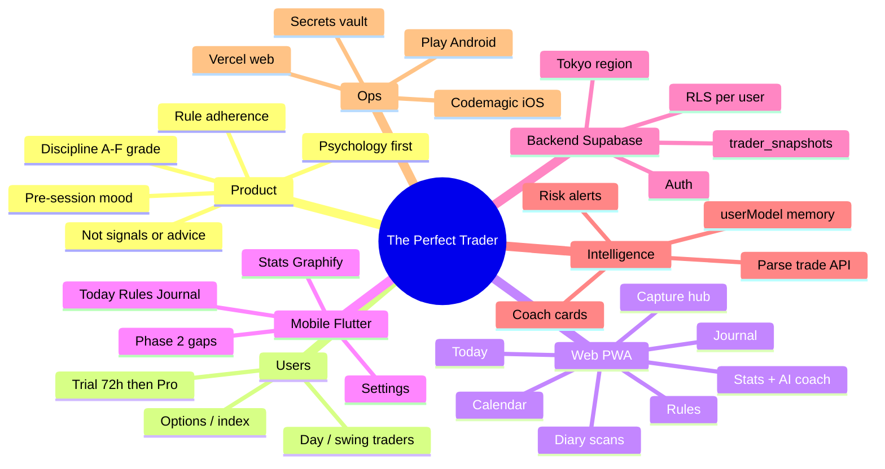

# Mind map — product & system

```mermaid
mindmap
  root((The Perfect Trader))
    Product
      Psychology first
      Not signals or advice
      Discipline A-F grade
      Pre-session mood
      Rule adherence
    Users
      Day / swing traders
      Options / index
      Trial 72h then Pro
    Web PWA
      Today
      Journal
      Rules
      Stats + AI coach
      Diary scans
      Calendar
      Capture hub
    Mobile Flutter
      Today Rules Journal
      Stats Graphify
      Settings
      Phase 2 gaps
    Backend Supabase
      Auth
      trader_snapshots
      RLS per user
      Tokyo region
    Intelligence
      Coach cards
      Risk alerts
      Parse trade API
      userModel memory
    Ops
      Vercel web
      Secrets vault
      Codemagic iOS
      Play Android
```

## One sentence

**Measure and improve trading discipline** (rules + mood + logs) so P&amp;L follows process—not the other way around.
