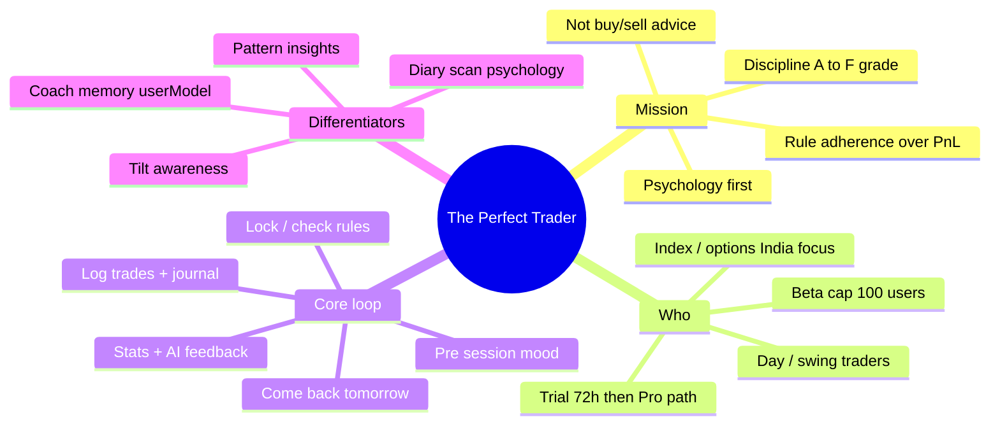
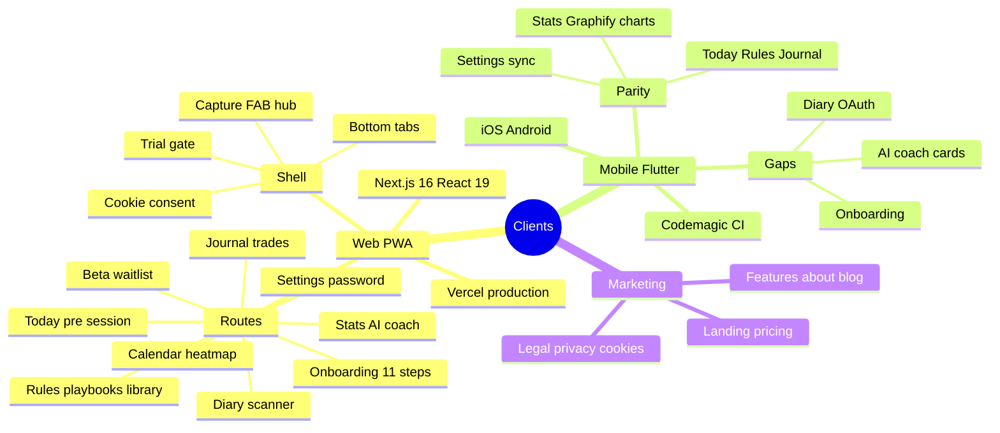
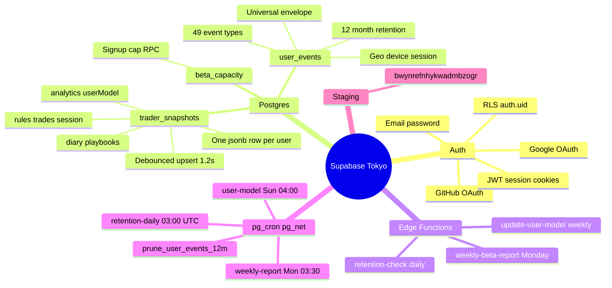
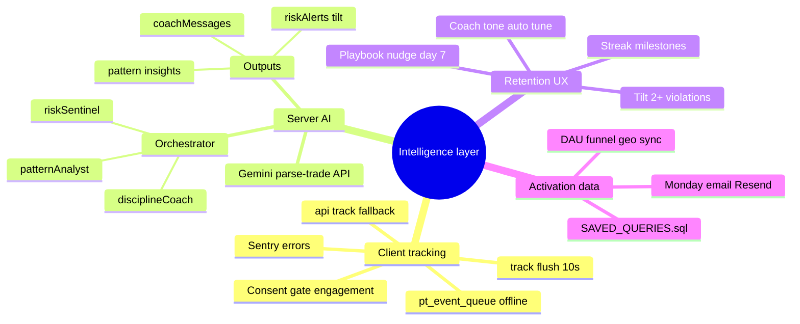
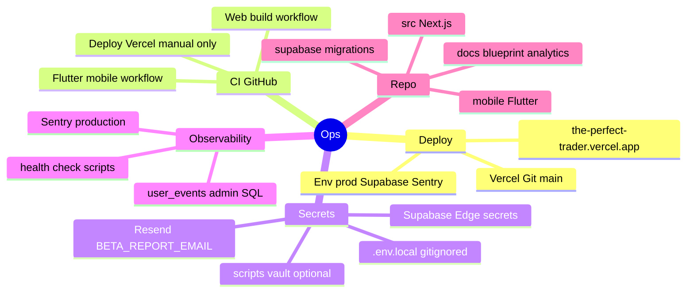
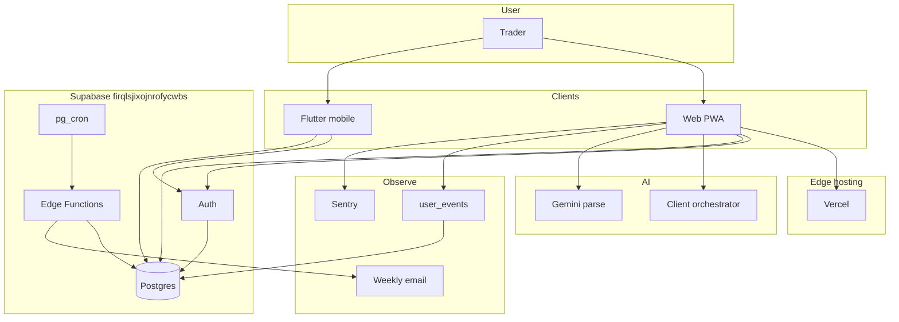
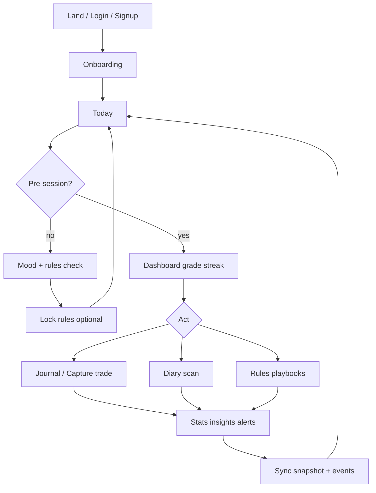

# Complete system mind map — The Perfect Trader

> **One sentence:** Measure and improve trading discipline (rules + mood + logs) so P&amp;L follows process—not signals.

---

## 1. Product & users (why it exists)

---

## 2. Clients & surfaces (what users touch)

---

## 3. Backend & data (where truth lives)

---

## 4. Analytics & intelligence (learn from behavior)

---

## 5. Infrastructure & ops (how it ships)

---

## 6. End-to-end flow (one picture)

---

## 7. Daily discipline loop (product core)

---

## 8. Status snapshot (May 2026)

| Area | Status |
|------|--------|
| Web app production | ✅ Live |
| Auth Google GitHub email | ✅ |
| Cloud sync `trader_snapshots` | ✅ |
| `user_events` tracking 49 events | ✅ |
| Edge functions ×3 | ✅ ACTIVE |
| pg_cron schedules | ✅ |
| Browser E2E verified | ✅ |
| Weekly report email | ✅ Tested |
| Real beta users | ⬜ Invite next |
| Mobile feature parity | 🟡 Partial |
| Stripe Pro billing | ⬜ |
| Normalized DB tables | ⬜ Future |

---

## 9. Key files (navigation)

| Topic | Path |
|-------|------|
| Mind map (this doc) | `docs/blueprint/00-mind-map.md` |
| Completion % / next work | `docs/blueprint/05-completion-status.md` |
| Architecture | `docs/blueprint/01-system-architecture.md` |
| Data flow | `docs/blueprint/02-data-flow.md` |
| User flows | `docs/blueprint/03-user-flows.md` |
| Feature map | `docs/blueprint/04-feature-map.md` |
| Tracking spec | `master-tracking-prompt.md` |
| Data activation | `data-layer-master.md` |
| Admin SQL | `docs/analytics/SAVED_QUERIES.sql` |
| Privacy / inventory | `docs/DATA_INVENTORY.md` |
| Cron setup | `docs/supabase/RUN_CRON_AND_RETENTION.sql` |

---

## Related blueprint index

See [README.md](./README.md) in this folder for the full doc set.
