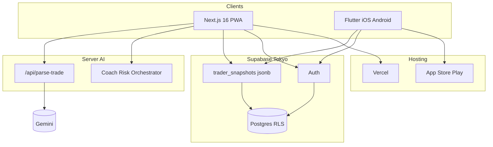
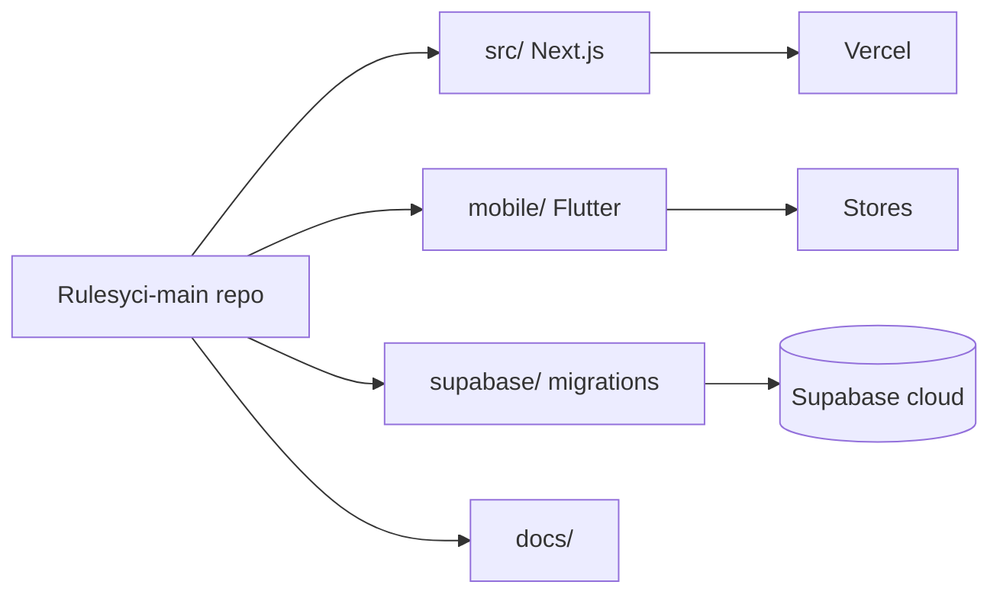
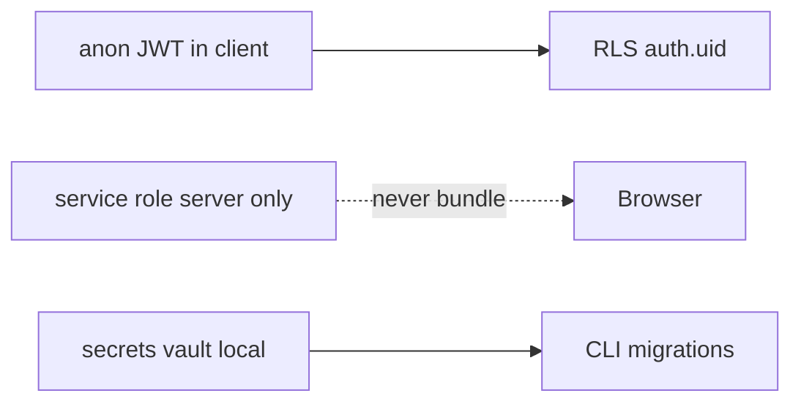

# System architecture (brief)

## Topology

## Layers

| Layer | Stack | Role |
|-------|--------|------|
| **Presentation** | React 19 / Flutter 3 | UI, navigation, forms |
| **App state** | Context reducer / Riverpod | Rules, trades, session, analytics |
| **Sync** | `supabase-data.ts` / `TraderSnapshotRepository` | Load + debounced upsert ~1.2s |
| **Local cache** | localStorage / Hive | Offline-first write, sync when online |
| **Backend** | Supabase only (v1) | Auth + one jsonb row per user |
| **AI** | Gemini via API route | Trade parse; coach logic mostly client |

## Monorepo (deploy units)

## Security boundary

See [../SECURITY_SECRETS.md](../SECURITY_SECRETS.md).
