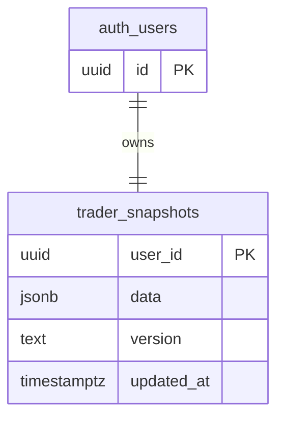
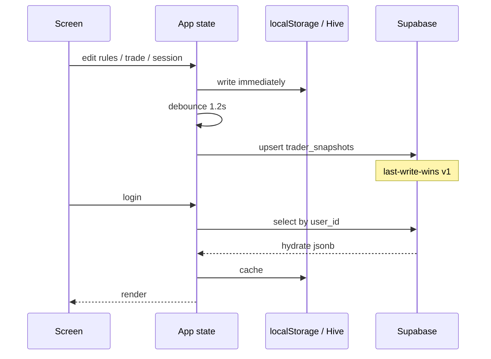
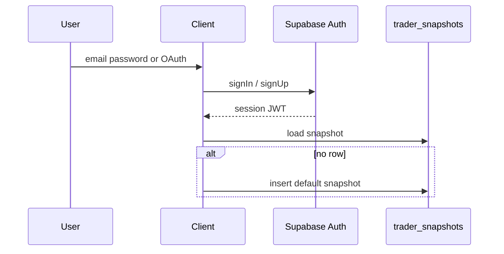
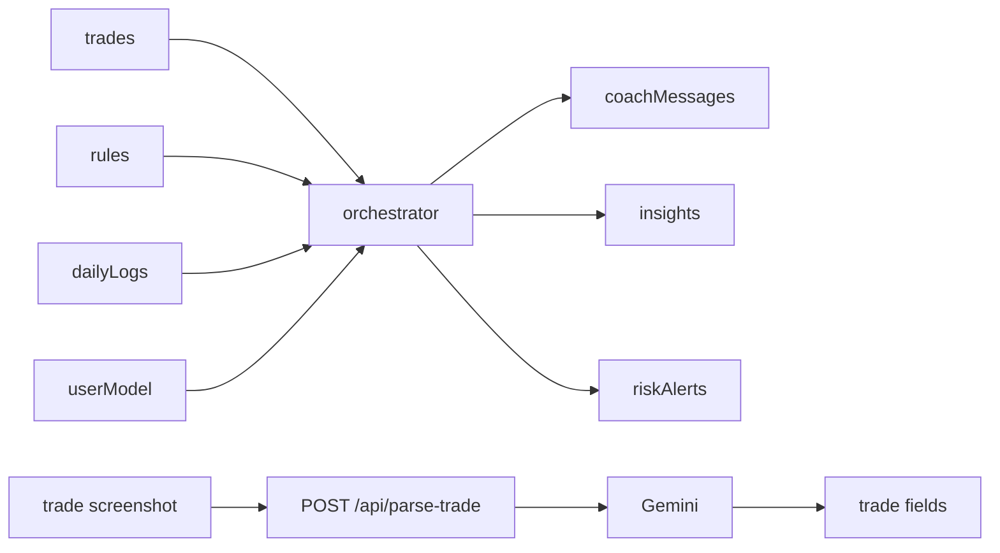

# Data flow

## Snapshot model (v1)

One row per user — no normalized trade tables yet.

**Inside `data` jsonb:** `user`, `session`, `rules[]`, `trades[]`, `dailyLogs[]`, `analytics`, `userModel` (optional).

Contract: [../mobile/DATA_CONTRACT.md](../mobile/DATA_CONTRACT.md)

## Sync sequence (web or mobile)

## Auth flow

## AI data path

Coach runs **client-side** today; parse-trade is **server-only** (`GEMINI_API_KEY`).
