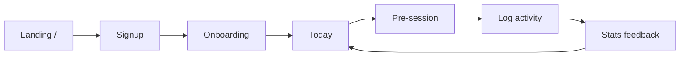
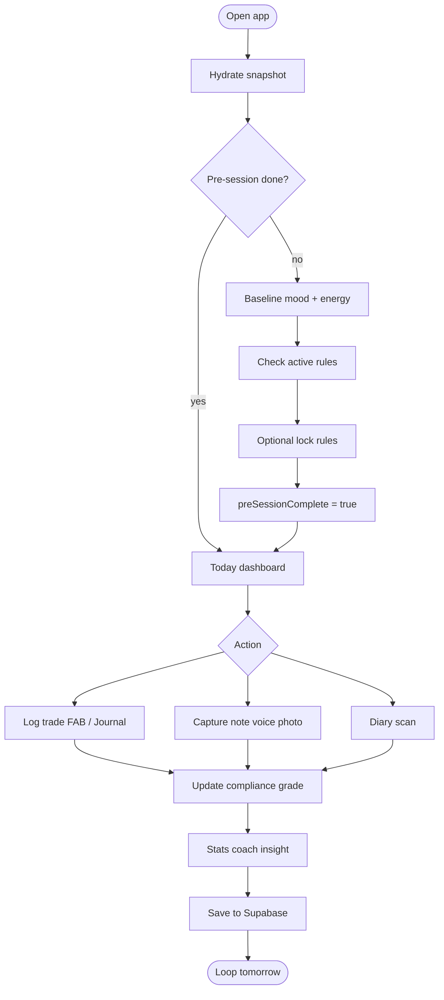
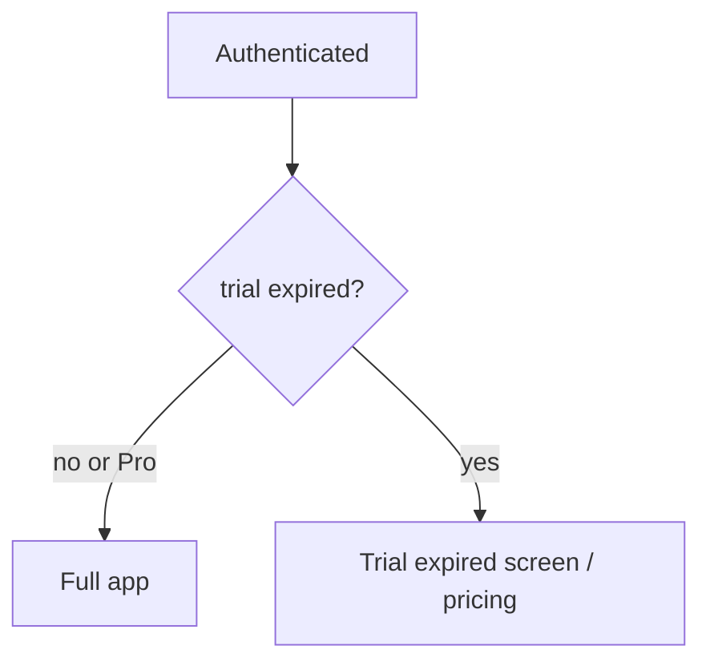

# User flows

## Journey (high level)



## Daily discipline loop (core)



**Why:** Without pre-session + graded check-in, the app is just another journal—this loop is the product.

## Route map — web

```mermaid
flowchart TB
  subgraph public [Public]
    home[/]
    login[/login]
    signup[/signup]
    pricing[/pricing]
  end

  subgraph app [Authenticated]
    today[/today]
    journal[/journal]
    calendar[/calendar]
    stats[/stats]
    rules[/rules]
    diary[/diary]
    settings[/settings]
  end

  login --> today
  signup --> onboarding[/onboarding]
  onboarding --> today
```

**Bottom nav (mobile web):** Today · Diary · Calendar · Rules · Stats

## Route map — Flutter mobile

```mermaid
flowchart TB
  auth[Auth login signup]
  auth --> shell[Bottom nav shell]
  shell --> t[/today]
  shell --> j[/journal]
  shell --> s[/stats]
  shell --> r[/rules]
  shell --> set[/settings]
  t --> pre[/pre-session]
  j --> add[/journal/add]
```

## Trial gate



## Capture sub-flow (web)

```mermaid
stateDiagram-v2
  [*] --> initial: FAB tap
  initial --> checklist: Log trade
  initial --> note: Quick note
  initial --> voice: Voice
  initial --> photo: Photo
  checklist --> [*]: ADD_TRADE
  note --> [*]: save
```
