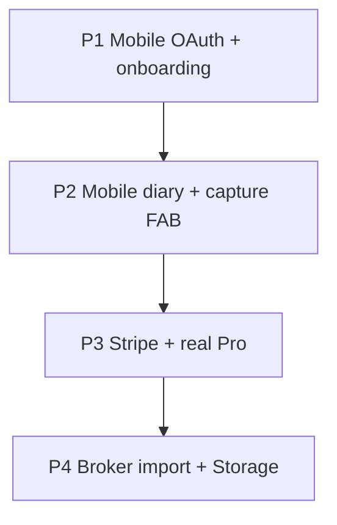

# Feature map — now vs next

## Status legend

| Symbol | Meaning |
|--------|---------|
| ✅ | Shipped |
| 🟡 | Partial / mock |
| ⬜ | Not started |

## Web (Next.js)

| Feature | Status | Why it matters |
|---------|--------|----------------|
| Email / OAuth auth | 🟡 OAuth callback gap | Identity + sync |
| Onboarding (11 steps) | ✅ | Activation |
| Today + pre-session + grade | ✅ | Core discipline loop |
| Rules library | ✅ | Defines behavior |
| Journal + trades | ✅ | Outcome ↔ rules |
| Stats + AI coach | ✅ | Feedback loop |
| Calendar heatmap | ✅ | Habit visualization |
| Diary scans | ✅ | Psychology moat |
| Capture hub (FAB) | ✅ | Low-friction log |
| Cloud sync jsonb | ✅ | Multi-device |
| Trial 72h / Pro allowlist | 🟡 No Stripe | Revenue path |
| Parse trade (Gemini API) | 🟡 UI uses mock sometimes | Speed of logging |
| Admin / API keys / Terminal | ✅ | Ops / power users |
| Marketing + legal | ✅ | GTM |

## Mobile (Flutter)

| Feature | Status | Why it matters |
|---------|--------|----------------|
| Email auth | ✅ | Minimum viable identity |
| Today + pre-session | ✅ | Same loop as web |
| Rules toggle | ✅ | Synced discipline |
| Journal + add trade | ✅ | Core logging |
| Stats + Graphify charts | ✅ | See patterns on phone |
| Settings + sync status | ✅ | Trust + sign out |
| Trial gate | ✅ | Monetization alignment |
| Snapshot sync | ✅ | Parity with web |
| Onboarding | ⬜ | Retention week 1 |
| Diary / camera | ⬜ | Parity + moat |
| Calendar | ⬜ | Streak visibility |
| Capture FAB | ⬜ | Speed on floor |
| Google / Apple OAuth | ⬜ | Store + signup friction |
| AI coach cards | ⬜ | Differentiator on mobile |
| Stripe Pro | ⬜ | Paid conversion |

## Backend / platform

| Feature | Status | Why it matters |
|---------|--------|----------------|
| `trader_snapshots` + RLS | ✅ | Secure per-user data |
| Migrations via CLI | ✅ | Repeatable schema |
| Encrypted secrets vault | 🟡 Run `secrets:migrate` | Protect keys |
| Normalized tables | ⬜ | Scale + reporting |
| Multi-device merge | ⬜ | Avoid overwrite conflicts |
| Push notifications | ⬜ | Daily habit nudge |
| Broker CSV import | ⬜ | Table stakes vs journals |
| Supabase Storage (diary) | ⬜ | Image persistence |

## Priority stack (recommended)

