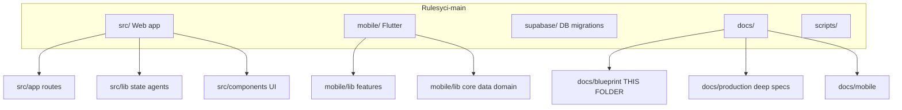

# Repository map (brief)

## Paths that matter

| Path | Purpose |
|------|---------|
| `src/app/(app)/` | Logged-in screens (today, journal, …) |
| `src/lib/context.tsx` | Web state + persistence |
| `src/lib/supabase-data.ts` | Cloud snapshot CRUD |
| `src/lib/agents/` | Coach, risk, orchestrator |
| `mobile/lib/features/` | Auth, today, journal, rules, stats, settings |
| `mobile/lib/data/` | Snapshot repo, Hive, mapper |
| `supabase/migrations/` | Schema source of truth |
| `docs/blueprint/` | Architecture & flow visuals |
| `scripts/secrets/` | Encrypted vault tooling |

## Deploy targets

| Artifact | Target |
|----------|--------|
| `src/` | Vercel (root = repo) |
| `mobile/` | Google Play + App Store |
| `supabase/migrations/` | `npm run db:push:url` → cloud |

Full tree: [../PROJECT_STRUCTURE.md](../PROJECT_STRUCTURE.md)
