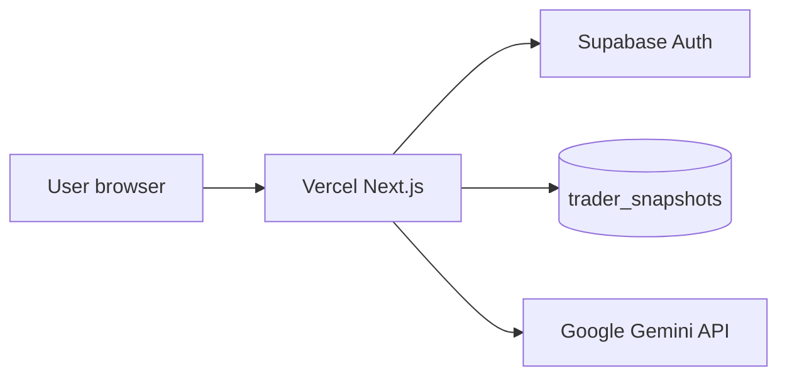

# Cloud deployment — THE PERFECT TRADER

Production stack: **Vercel** (app) + **Supabase** (auth + database) + optional **Gemini** (AI).

## Architecture (cloud)



| Service | Role | Region |
|---------|------|--------|
| Vercel | Host `npm run build` output | Edge / auto |
| Supabase | Auth + Postgres | ap-northeast-1 (Tokyo) |
| Gemini | `/api/parse-trade` | Google cloud |

**Supabase project ref:** `firqlsjixojnrofycwbs`

---

## Phase 1 — Supabase (database + auth)

### 1.1 Migrations

From your machine (repo root):

```powershell
npx supabase login
npx supabase link --project-ref firqlsjixojnrofycwbs
npm run db:push
```

Or paste `supabase/migrations/20260321000000_trader_snapshots.sql` in **SQL Editor**.

### 1.2 Auth settings

**Authentication → URL Configuration**

| Field | Production value |
|-------|------------------|
| Site URL | `https://YOUR_DOMAIN.com` |
| Redirect URLs | `https://YOUR_DOMAIN.com/**` |

Add `http://localhost:3000/**` for local dev.

### 1.3 Providers

- Enable **Email**
- Enable **Google/GitHub** only after `/auth/callback` route exists in app

### 1.4 RLS

Table `trader_snapshots` must have RLS policies (included in migration). Verify in **Database → Policies**.

---

## Phase 2 — Vercel (application)

### 2.1 Connect repository

1. [vercel.com](https://vercel.com) → Import `N-i-k-e-t/the-perfect-trader`
2. Framework: **Next.js**
3. **Root Directory:** `.` (repository root — **not** a subfolder)

### 2.2 Environment variables

| Variable | Environment | Notes |
|----------|-------------|-------|
| `NEXT_PUBLIC_SUPABASE_URL` | Production, Preview | Public |
| `NEXT_PUBLIC_SUPABASE_ANON_KEY` | Production, Preview | Public |
| `GEMINI_API_KEY` | Production | Server only — never `NEXT_PUBLIC_` |

Do **not** add service role key to Vercel unless you add server-only admin routes.

### 2.3 Deploy

Push to `main` → Vercel auto-deploys.

Manual:

```powershell
npm run build
```

### 2.4 Post-deploy checks

- [ ] https://YOUR_DOMAIN loads
- [ ] Signup → onboarding → today
- [ ] `trader_snapshots` row created in Supabase
- [ ] No secrets in browser bundle (check Sources tab)

---

## Phase 3 — Optional services

| Service | When |
|---------|------|
| Custom domain | Vercel → Domains |
| Sentry | Error tracking — not configured yet |
| Stripe | Payments — not configured yet |
| Staging Supabase | Separate project before high traffic |

---

## Local ↔ cloud parity checklist

| Check | Local | Cloud |
|-------|-------|-------|
| Same migration files | `supabase/migrations/` | `npm run db:push` |
| Same env var names | `.env.local` | Vercel dashboard |
| `DATA_VERSION` | `1.1.0` | same |
| Auth redirect URLs | localhost | production domain |

---

## Production blockers (fix before launch)

See [../production/OPEN-QUESTIONS.md](../production/OPEN-QUESTIONS.md) P0:

1. `/auth/callback` for OAuth
2. PWA icons in `public/`
3. Privacy page mentions cloud sync
4. Payment integration or disable Pro gate

---

## Rollback

| Layer | Action |
|-------|--------|
| App | Vercel → Deployments → Promote previous |
| Database | Supabase PITR (paid) or forward migration only |

---

## Secrets reference

Full keys (local only): `docs/supabase/SUPABASE_PROJECT.local.md` (gitignored).

Safe overview: `docs/supabase/SUPABASE_PROJECT.md`.
