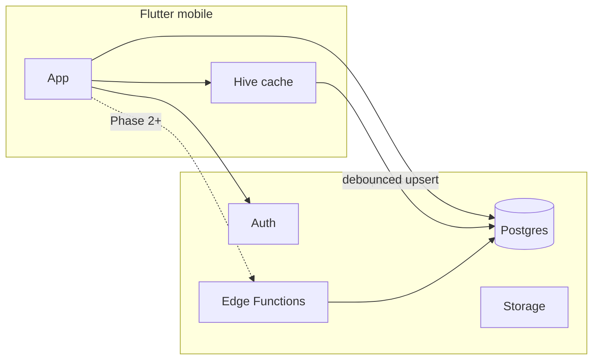

# Backend architecture (Supabase-first)

## Pattern

**Modular monolith on Supabase** — Flutter talks to Auth, Postgres, and Storage directly for v1. Edge Functions added for heavy or secret-bearing work.

## Module boundaries (logical)

| Module | v1 implementation | Future |
|--------|---------------------|--------|
| Auth | supabase_flutter | OAuth deep links |
| Trade data | jsonb snapshot upsert | Normalized `trades` |
| Psychology | Fields inside snapshot | `psychology_entries` |
| Analytics | Client-side from snapshot | SQL views / Edge agg |
| Imports | Not in mobile v1 | Edge: CSV parse |
| AI coaching | Web API route only | Edge + server key |
| Notifications | None | FCM + Edge cron |
| Subscriptions | Mock trial in snapshot | Stripe webhook Edge |
| Admin | Web only | Separate policies |

## Sync path (mobile)

1. `supabase.auth` session
2. `loadTraderData(userId)` → `trader_snapshots`
3. `SnapshotMapper.fromJson`
4. User edits → Riverpod state
5. `saveTraderData` debounced

Web equivalent: [`src/lib/supabase-data.ts`](../../src/lib/supabase-data.ts).

## Async jobs (Phase 2+)

| Job | Trigger | Runner |
|-----|---------|--------|
| CSV import parse | Upload complete | Edge Function |
| Report PDF | User request | Edge Function |
| AI weekly summary | Cron | Edge + pg_cron |
| Analytics rebuild | Trade bulk insert | Edge or worker |

## Idempotency

Required for: broker webhooks, CSV re-import, payment webhooks. Use stable external IDs on trade rows when normalized.

## Realtime

Optional for: live sync across devices. v1 uses pull on login + debounced push. Consider Supabase Realtime on `trader_snapshots` for v2.

## Trustworthy P&L

- P&L fields user-entered or import-derived in v1
- Server-side validation in Edge when broker sync exists
- Never trust client-only calculations for billing or leaderboards

## Disaster recovery

- Supabase Pro: PITR backups
- Export user data on account deletion request
- Document RTO/RPO in [SECURITY_COMPLIANCE.md](./SECURITY_COMPLIANCE.md)
