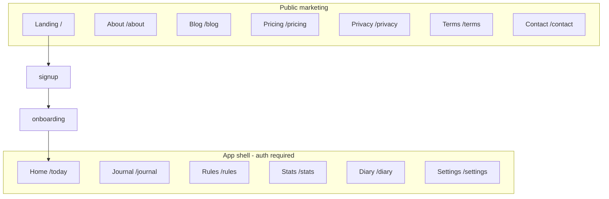

# Master launch plan — legal, beta, pages, design, marketing & resource dashboard

**One document** for privacy/policy thinking, blog, subscription strategy, site structure, brand, features, team needs, and resource allocation.  
**Product:** The Perfect Trader · **Stage:** Web beta → public market test.

---

## Part A — What you must understand (privacy & policy)

### A1. Legal posture (non-negotiable truths)

| Fact | What it means for copy |
|------|------------------------|
| You are **not** a broker or advisor | Every page: “not financial advice”; user owns trade decisions |
| You **do** store personal + trading behavior data in **Supabase** when logged in | Privacy page must **not** say “local only only” (current page is wrong — see `src/app/privacy/page.tsx`) |
| Data is split by **domain** (app / work / thoughts / history) | Explain in plain English: account vs trades vs diary/psychology — see [DATA_DOMAINS.md](../web/DATA_DOMAINS.md) |
| AI may send **some** text/images to **Google Gemini** if user uses scan/parse | Disclose subprocessors; optional feature |
| Users in India + globally | Plan for DPDP (India), GDPR-style rights if EU users, email for data requests |

### A2. Privacy policy — sections to ship (replace placeholders)

| # | Section | User-facing promise |
|---|---------|---------------------|
| 1 | Who we are | Legal entity name, contact email, country |
| 2 | What we collect | Account email; snapshot jsonb (rules, trades, logs, diary metadata); device/browser; optional AI uploads |
| 3 | Why we collect | Sync, grades, coaching, security, product improvement |
| 4 | Where stored | Supabase (region: ap-northeast-1 Tokyo — state in policy); encrypted in transit |
| 5 | Who can access | User (RLS); admins (named, audited); subprocessors (Supabase, Vercel, Google if AI on) |
| 6 | AI processing | Only when user triggers scan/parse; no selling data to train third-party models (state your actual Gemini terms) |
| 7 | Retention | Until account delete; backup retention if any |
| 8 | Rights | Export, delete account, correct email, withdraw consent for marketing |
| 9 | Children | Not for under 18 (or 16 per jurisdiction) |
| 10 | Changes | “Last updated” date + notice for material changes |
| 11 | Contact | `privacy@yourdomain.com` |

**Terms** must align: beta disclaimer, subscription (even if “free beta”), limitation of liability, acceptable use (no market manipulation claims), account termination.

### A3. Beta-specific legal line (add to Terms + footer)

> *The Perfect Trader is in **beta**. Features, pricing, and data handling may change. By using the beta you accept that service may be interrupted and that we may reset or migrate data with notice.*

### A4. Data you need from founders (not in repo)

| Input | Owner | For |
|-------|-------|-----|
| Legal company name / proprietor name | Founder | Privacy/Terms |
| Registered address (minimal) | Founder | Privacy |
| Support + privacy email | Founder | Policies |
| Whether you sell to EU/UK users | Founder | GDPR cookies banner |
| Exact AI data flow approval | Founder + legal review | Privacy §6 |
| Refund policy (when Stripe live) | Founder | Terms §3 |

---

## Part B — Beta subscription strategy (decision)

### Current code reality

| Mechanism | Location | Behavior |
|-----------|----------|----------|
| 72h trial | `AppShell.tsx` | After trial → paywall modal → `/pricing` |
| Pro bypass | `context.tsx` `ALLOWED_PRO_EMAILS` | Hardcoded allowlist |
| Pricing UI | `/pricing`, marketing `#pricing` | Shows ₹7,999 annual (marketing) |
| Stripe | — | **Not integrated** |

### Recommended for **market test beta** (ship now)

| Choice | Do this | Why |
|--------|---------|-----|
| **Paywall** | **Disable** hard trial expiry for all beta users | Friction kills feedback; no Stripe yet = broken promise |
| **Label** | Banner: “Beta — all features free; pricing later” | Honest + sets expectation |
| **Team** | Keep email allowlist for `isPro` / admin | Internal testing |
| **Stripe** | **Phase 2** after 20–50 active traders + retention signal | OPEN-QUESTIONS Q4 |
| **Terms** | Say “free beta; paid plans announced later” | Matches product |

### Implementation options (pick one)

| Option | Effort | Description |
|--------|--------|-------------|
| **B1 — Env flag** | Small | `NEXT_PUBLIC_BETA_MODE=true` → skip trial modal, hide paid CTAs or show “Notify me” |
| **B2 — Snapshot flag** | Medium | `user.betaCohort = true` for all signups until date X |
| **B3 — Remove gate** | Smallest | Comment out trial check in `AppShell` (quick test only) |

**Do not** market “₹7,999 annual” as purchasable until Stripe Checkout exists.

---

## Part C — Site map: landing vs app vs about

### Pages that exist today

| URL | Role | Audience | Status |
|-----|------|----------|--------|
| `/` | Marketing landing | Cold traffic | ✅ Heavy (video, features, pricing section) |
| `/login`, `/signup` | Auth | Returning / new | ✅ |
| `/onboarding` | Activation | New user | ✅ 11 steps |
| `/today` | **App home** (discipline loop) | Logged-in | ✅ Core |
| `/journal`, `/diary`, `/rules`, `/stats`, `/calendar` | App features | Logged-in | ✅ |
| `/settings` | Account | Logged-in | ✅ |
| `/pricing` | Monetization | Trial ended | 🟡 Copy vs beta |
| `/privacy`, `/terms` | Legal | Everyone | 🟡 Placeholder 2023 |
| `/contact` | Support | Everyone | ✅ Check copy |
| `/welcome` | Post-onboarding? | — | 🟡 Orphan — wire or delete |
| **About us** | Trust, story, team | Cold traffic | ⬜ **Missing route** |

### Recommended information architecture



| Page | Job | Must answer |
|------|-----|-------------|
| **Landing `/`** | Convert → signup | What is it? Why not Tradervue? CTA |
| **App home `/today`** | Daily habit | What do I do right now? |
| **About `/about`** | Trust | Who built it? Why psychology-first? Not signals |
| **Blog `/blog`** | SEO + authority | Discipline, tilt, rule design — not stock tips |

**Landing vs app home:** Landing = white, marketing, story, social proof. App = dark `#1a1a2e`, tools, no SEO fluff.

---

## Part D — Design system (from codebase — use as source of truth)

### D1. Color tokens

| Token | Hex | Use |
|-------|-----|-----|
| Primary / shell | `#1a1a2e` | App background, headers, primary buttons (marketing) |
| Accent / warning | `#f59e0b` | CTAs, highlights, Pro badges |
| Success | `#22c55e` | Positive grade, wins |
| Danger | `#ef4444` | Violations, losses |
| Neutral text | `#94a3b8` | Secondary copy |
| Marketing BG | `#ffffff` | Landing only |
| Star rating | `#eab308` | Social proof |
| Orange wash | `orange-50/600` | Feature cards |

File: `src/app/globals.css` `@theme`

### D2. Typography & shape

| Element | Spec |
|---------|------|
| Font | Inter (`next/font`) |
| Headings | `font-black`, tight tracking |
| Body | 15px, relaxed leading |
| Radius | 32–48px cards; `rounded-full` pills |
| Icons | Lucide React |
| Motion | Framer Motion on landing (`itemVariants`) |

### D3. Asset gaps (production)

| Asset | Size | Status |
|-------|------|--------|
| PWA 192 / 512 | PNG | Missing |
| Apple touch | 180 | Missing |
| OG social | 1200×630 | Missing |
| Logo wordmark | SVG | Text-only in UI |
| Hero video | MP4 or embed | On landing — verify host |
| Product screenshots | `public/brain/` | Referenced — verify files |
| Founder photos | About page | Not in repo |

### D4. Page-level design checklist

| Surface | Elements to produce |
|---------|---------------------|
| Landing | Hero video, 3 feature screenshots, testimonial avatars, trust badges, FAQ, footer legal links |
| About | Founder story, mission, “not advice” block, press kit link |
| App | Empty states per tab, grade animation, trial/beta banner |
| Blog | Cover images 1200×630, author card, CTA to signup |

---

## Part E — Feature × element matrix (what to design/test per feature)

| Feature | Route | UI elements | Data domain | Beta note |
|---------|-------|-------------|-------------|-----------|
| Pre-session | `/today` | Mood slider, notes, complete CTA | work + thoughts | Core loop |
| Grade / compliance | `/today` | A–F, %, rule checklist | work | Document formula |
| Rules | `/rules` | Library, toggle, emoji categories | work | |
| Journal | `/journal` | Trade list, search, add modal | work | Fix `/journal/[id]` |
| Capture FAB | global | Photo/voice/note/checklist | work + thoughts | |
| Diary scans | `/diary` | Scanner modal, grid | thoughts | AI disclosure |
| Stats | `/stats` | Charts, coach cards, streak | work + thoughts | |
| Calendar | `/calendar` | Heatmap, week strip | work | |
| Settings | `/settings` | Export, logout, subscription row | app | Export = GDPR |
| Pricing | `/pricing` | Plans, timer | app | Beta: waitlist only |
| Admin | `/admin` | User ops | app | Server guard TBD |
| AI parse | `/api/parse-trade` | — | thoughts | Rate limit |
| Onboarding | `/onboarding` | 11 steps, `/brain` images | app | |

---

## Part F — Blog plan (content, not code)

### Positioning

**Topic pillar:** Trading *discipline* and *psychology* — never “buy this stock.”

### First 6 posts (suggested)

| # | Title angle | CTA |
|---|-------------|-----|
| 1 | Why P&L is the wrong scorecard for day traders | Signup |
| 2 | Pre-session checklist: 5 minutes that prevent tilt | Today feature |
| 3 | How to write rules you’ll actually follow | Rules feature |
| 4 | Revenge trading: recognize the 3 triggers | Coach angle |
| 5 | Paper journal vs digital compliance audit | Diary scan |
| 6 | Beta invite: what we’re building (founder story) | About + waitlist |

### Blog ops

| Need | Tool options |
|------|----------------|
| Hosting | MDX in Next `/blog` or Notion → export |
| Author | Founder name + photo |
| SEO | Title, meta, OG per post |
| Legal | Disclaimer footer on every post |

---

## Part G — PR & marketing team — roles & deliverables

### Team roles (minimum viable)

| Role | Responsibility | First deliverable |
|------|----------------|-----------------|
| **Founder / PM** | Vision, beta cohort, policy approval | Beta announcement post |
| **Design** | Landing, about, app empty states, icons | Figma + `public/` export |
| **Copy / content** | Privacy, terms, blog, landing copy | Policy v1 + 2 blogs |
| **Growth** | Waitlist, Discord/Twitter, creator outreach | 20 beta trader invites |
| **PR** (optional) | Press kit, founder quote | 1-page PDF + 3 screenshots |
| **Dev** | Beta flag, `/about`, `/blog` shell, policy pages | Ship B1 + legal pages |
| **Legal** (advisor) | Review privacy/terms | Sign-off checklist |

### PR kit contents

| Item | Format |
|------|--------|
| One-liner | “Psychology-first discipline OS for traders” |
| 60s demo video | Landing hero |
| 3 screenshots | Today, Rules, Stats |
| Founder bio | 150 words |
| Contact | press@domain |
| Beta angle | “Free beta — feedback welcome” |

### Channels (90-day sketch — from PRODUCT_VISION_GTM)

| Week | Action |
|------|--------|
| 1–2 | 20–50 closed beta traders |
| 3–4 | Testimonials on landing (real names) |
| 5–8 | Trading Twitter / YouTube / Discord |
| 9–12 | SEO blog + soft public launch |

---

## Part H — Resource dashboard (allocator template)

Use a Notion/Sheet/Airtable board with these columns:

| Column | Description |
|--------|-------------|
| Resource ID | R-001… |
| Category | People / Design / Dev / Legal / Infra / Marketing |
| Name | e.g. “Privacy policy v1” |
| Needed for | App / Platform / GTM |
| Priority | P0 / P1 / P2 |
| Status | Backlog / In progress / Done / Blocked |
| Owner | Person |
| Effort | S / M / L |
| Depends on | Other resource IDs |
| Cost | ₹ or $ estimate |
| Due | Date |
| Output link | Figma, doc, PR |

### Starter resource list (copy into your dashboard)

| ID | Resource | Cat | Priority | For |
|----|----------|-----|----------|-----|
| R-001 | Privacy policy v1 (accurate cloud + AI) | Legal | P0 | Platform |
| R-002 | Terms v1 + beta clause | Legal | P0 | Platform |
| R-003 | `BETA_MODE` + disable trial paywall | Dev | P0 | App |
| R-004 | Update privacy page in code | Dev | P0 | App |
| R-005 | `/about` page | Dev + Copy | P1 | GTM |
| R-006 | `/blog` route + 1st post | Dev + Copy | P1 | GTM |
| R-007 | PWA icons 192/512 | Design | P0 | App |
| R-008 | OG image + favicon pack | Design | P1 | GTM |
| R-009 | Hero video (compressed) | Design | P1 | GTM |
| R-010 | Product screenshots `public/brain/` | Design | P1 | GTM |
| R-011 | Landing copy audit (remove fake metrics?) | Copy | P1 | GTM |
| R-012 | 20 beta user interviews | Growth | P0 | Product |
| R-013 | PostHog or Plausible | Dev | P2 | Platform |
| R-014 | Stripe Checkout (post-beta) | Dev | P2 | App |
| R-015 | Press kit PDF | PR | P2 | GTM |
| R-016 | Staging Supabase project | Dev | P2 | Platform |
| R-017 | Sentry | Dev | P2 | Platform |
| R-018 | About founder photos | Design | P1 | GTM |
| R-019 | Email templates (welcome, beta) | Marketing | P1 | Platform |
| R-020 | Data export + delete account flow | Dev | P1 | Legal |

### Capacity formula (simple)

```
Total effort (weeks) = Σ (effort S=0.5, M=1, L=2) per owner
Owner load = sum assigned resources; cap at 1.0 FTE per person for beta phase
```

---

## Part I — What the repo already gives you vs what you must create

### From repo (ready to cite)

| Data | Location |
|------|----------|
| Feature list + status | `docs/blueprint/04-feature-map.md` |
| User flows | `docs/production/02-USER-FLOWS-AND-LOOPS.md` |
| Colors / radius | `src/app/globals.css` |
| Brand strings | `src/lib/brand.ts` |
| Data domains | `docs/web/DATA_DOMAINS.md` |
| Trial/Pro logic | `src/components/AppShell.tsx`, `src/lib/context.tsx` |
| Routes | `src/app/**/page.tsx` |
| Go-live steps | `docs/guides/GO_LIVE_NOW.md` |
| Asset gaps | `docs/production/08-ASSETS-AND-DESIGN.md` |
| Open decisions | `docs/production/OPEN-QUESTIONS.md` |

### You must supply (external)

| Data | Used for |
|------|----------|
| Legal entity + emails | Policies |
| Founder story + photos | About, blog |
| Real testimonials (or remove fake “2,100+”) | Landing trust |
| Final pricing decision | Pricing page |
| Beta cohort rules | Subscription |
| Video files + brand logo | Marketing |
| Analytics tool choice | Funnel |
| Budget per resource row | Dashboard |

---

## Part J — Phased work order (single backlog)

### Phase 0 — Beta live (this week)

1. R-003 Beta mode — no paywall  
2. R-001 / R-002 / R-004 Legal pages truthful  
3. R-007 PWA icons  
4. GO_LIVE_NOW deploy  
5. R-012 Recruit 20 beta users  

### Phase 1 — Trust & content (week 2–3)

6. R-005 About  
7. R-006 Blog + post 1–2  
8. R-010 Screenshots  
9. R-011 Landing honesty pass  

### Phase 2 — Growth (week 4–8)

10. R-013 Analytics  
11. R-015 PR kit  
12. R-019 Email flows  
13. Testimonials on landing  

### Phase 3 — Monetize (after validation)

14. R-014 Stripe  
15. R-020 Export/delete hardening  
16. Staging + Sentry  

---

## Part K — Quick decisions (fill in)

| # | Decision | Your choice (write here) |
|---|----------|--------------------------|
| D1 | Beta paywall | Off / soft reminder only |
| D2 | Show ₹ pricing on landing | Hide / “Coming soon” / Keep |
| D3 | About page route | `/about` |
| D4 | Blog host | Next MDX / Notion |
| D5 | Legal reviewer | Name / date |
| D6 | Target beta size | 20 / 50 / 100 |
| D7 | Fake social proof on landing | Remove / replace with real |

---

*Maintained with product code. Update when Stripe, policies, or routes ship.*
