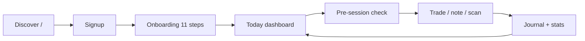

# 02 — User flows & closed loops

## Primary persona journey

## Route map (production)

### Public

| Route | Purpose |
|-------|---------|
| `/` | Marketing landing |
| `/login`, `/signup` | Auth |
| `/pricing` | Plans (trial expiry destination) |
| `/terms`, `/privacy`, `/contact` | Legal / support |

### Authenticated core

| Route | Purpose | In bottom nav? |
|-------|---------|----------------|
| `/today` | Daily command center | Yes |
| `/journal` | Trades + scans | Yes |
| `/calendar` | PnL / timeline | Yes |
| `/stats` | Analytics + coach cards | Yes |
| `/rules` | Rule library & playbooks | No |
| `/diary` | Scan history | No |
| `/settings` | Full settings page | No (sheet from header) |
| `/onboarding` | First-time profile | Middleware |
| `/admin`, `/the-terminal-x` | Admin only | No |

Redirect: `/dashboard` → `/today` (permanent).

## Closed loop 1 — Daily discipline (core)

```mermaid
sequenceDiagram
  participant U as User
  participant T as /today
  participant C as Context
  participant S as Supabase

  U->>T: Open app
  T->>C: Hydrate local + cloud
  U->>T: DailyStateCheck sleep/energy
  T->>C: preSessionComplete
  U->>T: Check rules, set mood
  T->>C: session + dailyLogs
  U->>T: FAB Log Trade
  T->>C: addTrade
  C->>C: riskSentinel alerts
  C->>S: Debounced snapshot save
  U->>T: See compliance grade update
```

**Loop closes when:** user sees updated compliance score / grade for the day and optional coach message on Stats.

## Closed loop 2 — Trade capture

| Step | UI | State |
|------|-----|-------|
| 1 | BottomTabs FAB → “Log Trade” | `captureMode: checklist` |
| 2 | `CaptureHub` multi-step form | — |
| 3 | Submit | `ADD_TRADE` |
| 4 | Risk sentinel runs | `ADD_RISK_ALERT` |
| 5 | Persist | localStorage + `trader_snapshots` |

**Gap:** “Magic” parse uses client mock (`magicJournal`), not `POST /api/parse-trade` (Gemini).

## Closed loop 3 — Auth & identity

| Step | Mechanism |
|------|-----------|
| Sign up / login | Supabase Auth (email or OAuth) |
| Session | Cookies + `onAuthStateChange` |
| Profile | `user` in context; Pro via email allowlist |
| Logout | `signOut` + clear `perfect_trader_data` |

**Gap:** OAuth expects `/auth/callback` — route not implemented.

## Closed loop 4 — Trial & monetization

| Event | Behavior |
|-------|----------|
| New user | `trialStartDate` set |
| &lt; 72h | Full app access |
| Trial expired + not Pro | `AppShell` blocks → `/pricing` |
| Pro emails (hardcoded) | `isPro` bypass |

**Gap:** No Stripe/payment integration in codebase—pricing is presentational.

## Closed loop 5 — Coaching / insights

| Source | Where shown | Persisted in context? |
|--------|-------------|-------------------------|
| `runOrchestrator()` | `/stats` page only | No (computed per visit) |
| `disciplineCoach` templates | Via orchestrator | Optional via `setCoachMessages` (unused from Stats) |
| Risk alerts | After trade + orchestrator | Yes (`riskAlerts` in snapshot) |

**Why it matters:** Insights on Stats do not write back to global state—refreshing another tab won’t show same coach cards unless recomputed.

## Interaction patterns

| Pattern | Component | Notes |
|---------|-----------|-------|
| Bottom nav + FAB | `BottomTabs` | Mobile-first; max-width ~430px in `AppShell` |
| Header settings | `SettingsSheet` | Overlay, not route |
| Full-screen overlays | `DailyStateCheck`, `LabMode`, `CaptureHub` | z-index 200+ |
| Toasts | `Toast` + `showToast` | Not persisted |

## Orphan / broken flows (fix before prod)

| Issue | Impact |
|-------|--------|
| No `/auth/callback` | OAuth broken |
| No `/journal/[id]` | Trade detail links 404 |
| No `/cookies` | Footer link broken |
| `/welcome` unlinked | Onboarding tour unused |
| `Sidebar` / `MobileNav` unused | Desktop nav incomplete |

Details: [OPEN-QUESTIONS.md](./OPEN-QUESTIONS.md).
