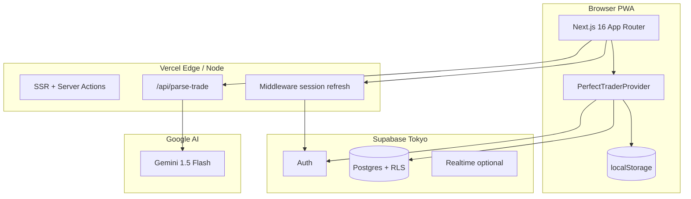

# 03 — System architecture

## High-level topology



## Repository structure (complete)

```
Rulesyci-main/                    # Git repo (GitHub: trading-4j1)
├── README.md
├── docs/
│   ├── PROJECT_STRUCTURE.md
│   ├── assets/                   # PDF references (Perfect Trading, etc.)
│   └── production/               # ← This documentation set
├── legacy/                       # Not deployed
│   ├── anchor-root/              # Old Vite app
│   ├── anchor-app/
│   ├── DisciplineOS/
│   └── scripts/                  # Old .bat deploy files
└──            # Vercel root directory
    ├── src/
    │   ├── app/                  # Routes (marketing), (app), api
    │   ├── components/           # UI shells, calendar, capture
    │   ├── lib/
    │   │   ├── context.tsx       # Global state + persistence
    │   │   ├── brand.ts          # Names + storage keys
    │   │   ├── supabase-data.ts  # Cloud snapshot CRUD
    │   │   └── agents/           # Coach, risk, journal, orchestrator
    │   ├── types/                # trading.ts, database.ts
    │   └── utils/supabase/       # client, server, middleware
    ├── public/                   # manifest, favicon, PWA icons
    ├── supabase/migrations/      # Schema source of truth
    ├── docs/                     # Supabase project docs
    ├── scripts/                  # setup-supabase.ps1
    ├── .env.local                # Secrets (gitignored)
    └── package.json
```

## Frontend architecture

| Layer | Technology | Responsibility |
|-------|------------|----------------|
| Framework | Next.js 16 (App Router) | Routing, SSR, API routes |
| UI | React 19 + Tailwind 4 | Components, mobile-first layout |
| State | `useReducer` in context | Single client store |
| Motion | Framer Motion | Marketing + modals |
| Auth client | `@supabase/ssr` | Browser session |

**Layout hierarchy:**

```
RootLayout
└── PerfectTraderProvider
    ├── (marketing)/ → landing only
    └── (app)/layout → AppShell
        ├── Header
        ├── Main (max-w ~430px)
        ├── BottomTabs + FAB
        └── Overlays (Capture, DailyState, Settings)
```

## Backend architecture (current)

There is **no custom Node server**. Backend = **Supabase** + **one Next API route**.

| Capability | Implementation |
|------------|----------------|
| Auth | Supabase Auth |
| Database | Postgres `trader_snapshots` (JSON blob per user) |
| File storage | Not used yet |
| AI | `GEMINI_API_KEY` on server only (`liveAiEngine`) |
| Payments | Not implemented |

## Middleware

File: `src/middleware.ts` → `updateSession()` in `utils/supabase/middleware.ts`

- Refreshes session cookies
- Redirects unauthenticated users from core app paths to `/login`
- Skips entirely if Supabase env not configured (demo mode)

## Deployment

| Service | Role |
|---------|------|
| **Vercel** | Host Next.js (`root: the-perfect-trader`) |
| **Supabase** | Auth + DB (`firqlsjixojnrofycwbs`, ap-northeast-1) |

Env vars on Vercel must mirror `.env.local` (never expose `SUPABASE_SERVICE_ROLE_KEY` to client bundles).

## Integration boundaries (future)

| Integration | Status |
|-------------|--------|
| Broker APIs (`/api-keys` UI) | UI only, no live connection |
| Stripe | Not present |
| Email (transactional) | Not present |
| Push notifications | PWA install prompt only |

See [04-BACKEND-DATA-FLOW.md](./04-BACKEND-DATA-FLOW.md) for persistence detail.
