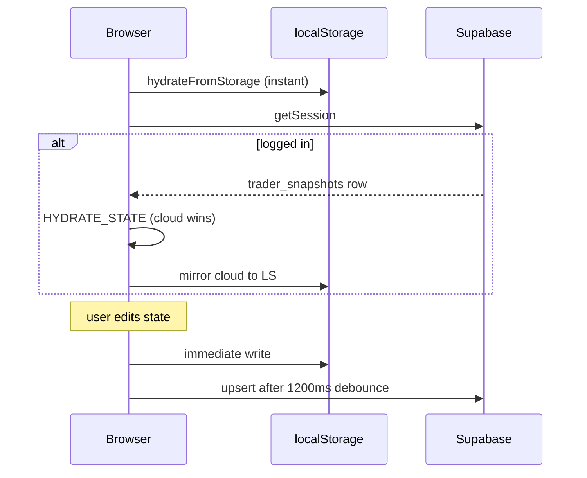

# 04 — Backend & data flow

## Data model (current)

### Supabase: `public.trader_snapshots`

| Column | Type | Purpose |
|--------|------|---------|
| `user_id` | uuid PK | FK → `auth.users` |
| `data` | jsonb | Full app snapshot (rules, trades, session, …) |
| `version` | text | Schema version (`1.1.0`) |
| `updated_at` | timestamptz | Last save |

**Why JSON blob (MVP):** Fast to ship; one upsert syncs entire client state.  
**Trade-off:** No SQL analytics on trades; large payloads over time; merge conflicts possible.

### Auth metadata (separate)

Onboarding writes `user_metadata` via `auth.updateUser()` (e.g. `onboarding_completed`)—not inside `trader_snapshots`.

## Sync protocol

### Rules

| Rule | Behavior |
|------|----------|
| Version gate | Only hydrate if `version === DATA_VERSION` |
| Cloud precedence | On login, cloud overwrites local |
| Debounce | 1.2s before upsert (reduces API calls) |
| Logout | Clear local key + reset React state |
| Offline | LocalStorage still works; cloud sync when back online |

### Legacy migration

On boot: if `rulesci_data` exists and `perfect_trader_data` does not → copy to new key.

## API routes

| Route | Method | Body | Response |
|-------|--------|------|----------|
| `/api/parse-trade` | POST | `{ note, activeRules }` | Trade-shaped JSON |

Uses `liveAiEngine.askAi()` → Gemini or mock fallback.

**Production gap:** `TradeEntryModal` does not call this route.

## Server vs client data access

| Operation | Where |
|-----------|--------|
| Read/write snapshot | Browser via anon key + RLS |
| Admin stats (terminal) | Client Supabase (admin user) |
| Parse trade AI | Server route only (`GEMINI_API_KEY`) |

**Never** put `SUPABASE_SERVICE_ROLE_KEY` in `NEXT_PUBLIC_*` or client components.

## Environment variables

| Variable | Scope | Required for prod |
|----------|-------|-------------------|
| `NEXT_PUBLIC_SUPABASE_URL` | Client + server | Yes |
| `NEXT_PUBLIC_SUPABASE_ANON_KEY` | Client + server | Yes |
| `GEMINI_API_KEY` | Server only | For real AI parse |
| `SUPABASE_SERVICE_ROLE_KEY` | Server scripts only | Optional (admin jobs) |
| `DATABASE_URL` | Prisma/migrations CLI | For `db:push` |

## Production data checklist

- [ ] Run migration `20260321000000_trader_snapshots.sql` on cloud
- [ ] Enable Email (+ OAuth providers if used)
- [ ] Set Site URL + redirect URLs for production domain
- [ ] Implement `/auth/callback` for OAuth
- [ ] Plan normalized tables before 10k+ trades per user
- [ ] Backup strategy (Supabase PITR on paid plan)

## Future backend shape (recommended)

| Table | Purpose |
|-------|---------|
| `trades` | One row per trade, indexed by user + date |
| `rules` | User rules |
| `daily_logs` | Compliance per day |
| `diary_entries` | Scans metadata; images in Storage |

Keep `trader_snapshots` as cache or remove after migration.
