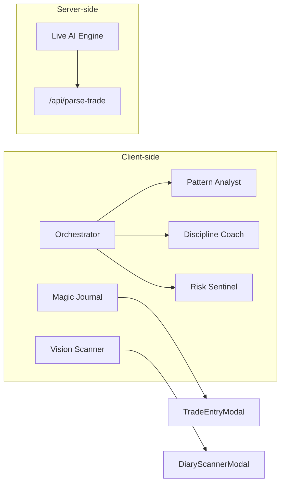

# 05 — AI agents

## Philosophy

Agents are **discipline coaches**, not signal generators. They interpret **user-entered behavior** (trades, rules, mood)—never market predictions.

## Agent map



| Agent | File | Runtime | User sees it when |
|-------|------|---------|-------------------|
| **Orchestrator** | `orchestrator.ts` | Client | Visiting `/stats` |
| **Pattern Analyst** | `patternAnalyst.ts` | Client heuristics | Via orchestrator (insights) |
| **Discipline Coach** | `disciplineCoach.ts` | Client templates | Coach cards on Stats |
| **Risk Sentinel** | `riskSentinel.ts` | Client rules | After each trade; orchestrator |
| **Magic Journal** | `magicJournal.ts` | Client regex mock | Trade entry “Magic” tab |
| **Vision Scanner** | `visionScanner.ts` | Client mock | Diary photo scan |
| **Live AI Engine** | `liveAiEngine.ts` | Server (Gemini) | Only if UI calls `/api/parse-trade` |
| **Learner** | `learner.ts` | — | **Not wired** |
| **Rule Suggester** | `ruleSuggester.ts` | — | **Not wired** |

## Orchestrator contract

**Input:** trades, rules, dailyLogs, streaks, mood, `userModel`  
**Output:**

- `insights[]` — patterns (day of week, mood, rule breaks)
- `coachMessages[]` — tone from `userModel.responds_to`
- `riskAlerts[]` — limits, tilt, consecutive breaks

**UI today:** `/stats` computes in `useMemo`; does **not** persist to context.

## Risk Sentinel (real-time guardrails)

Triggered on `addTrade` in `context.tsx`:

- Compares new trade to active rules + session emotional baseline
- Dispatches `ADD_RISK_ALERT` (severity: info / warning / critical)

**Why:** Closes loop at moment of risk—not only on weekly review.

## Gemini path (production-ready, underused)

```
POST /api/parse-trade
  → liveAiEngine.askAi(prompt, isJson: true)
  → gemini-1.5-flash OR simulateAi() if no GEMINI_API_KEY
```

**To wire for prod:**

1. `TradeEntryModal` calls API instead of `parseRoughNote`
2. Show loading + error states
3. Rate-limit per user (Vercel + optional Supabase edge function)
4. Never send service role key to client

## Agent ↔ user interface

| User action | Agent response | Surface |
|-------------|----------------|---------|
| Log trade | Risk Sentinel | Toast / alert card |
| Open Stats | Orchestrator | Insight cards, coach messages |
| Magic parse note | Magic Journal (mock) | Form pre-fill |
| Scan diary image | Vision Scanner (mock) | Extracted fields modal |
| Admin terminal | Live AI (optional) | `/the-terminal-x` |

## Tone & safety (product rules)

- No “buy/sell” language in agent outputs
- Warnings for tilt, revenge trading, rule breaks
- Encourage data-backed reflection (`responds_to: 'data'`)

## Production roadmap for agents

| Priority | Task |
|----------|------|
| P0 | Wire `/api/parse-trade` to trade entry |
| P1 | Persist orchestrator output to context (or DB) |
| P2 | Wire `learner` + `ruleSuggester` on `/rules` |
| P3 | Real vision API for diary scans (Storage + Gemini Vision) |
| P4 | Server-side orchestrator cron for weekly review emails |

See [OPEN-QUESTIONS.md](./OPEN-QUESTIONS.md) for model/cost decisions.
