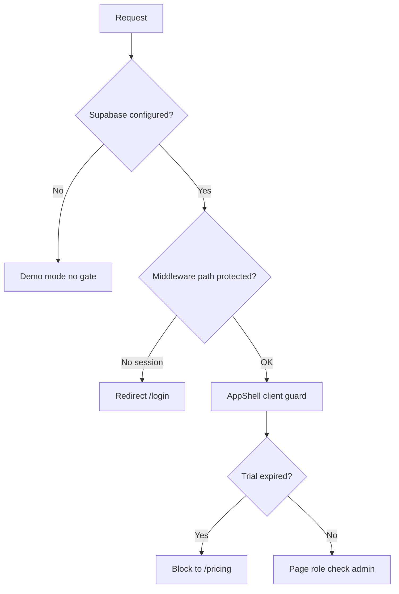

# 06 — Security

## Threat model (summary)

| Threat | Mitigation today | Gap |
|--------|------------------|-----|
| Unauthorized data access | RLS on `trader_snapshots` | JSON blob = all-or-nothing per user |
| XSS stealing local data | Same-origin; React escaping | `localStorage` readable by any script on origin |
| Stolen anon key | RLS limits to own row | Anon key is public in client bundle (expected) |
| Stolen service role key | Not in client | Must never commit; rotate if leaked |
| OAuth hijack | Needs secure callback | `/auth/callback` missing |
| AI prompt injection | Limited exposure | Sanitize note before Gemini |
| Admin route exposure | `isAdmin` client check | Middleware doesn’t guard `/admin` |

## Authentication

| Method | Status |
|--------|--------|
| Email/password | Supabase Auth |
| Google / GitHub OAuth | UI present; callback route missing |
| Session | HTTP-only cookies via `@supabase/ssr` |
| Middleware refresh | `updateSession` on each request |

**Pro / Admin flags:** Hardcoded email allowlist in `context.tsx`—not suitable for scale; move to `user_metadata` or `profiles` table.

## Authorization layers

**Harden for production:**

- Extend middleware to `/settings`, `/admin`, `/the-terminal-x`
- Server-side admin checks for sensitive API routes
- Remove client-only admin for destructive actions

## Row Level Security (RLS)

Policies on `trader_snapshots`:

- SELECT / INSERT / UPDATE where `auth.uid() = user_id`

**Verify:** No policy allows anon read of other users’ rows.

## Secrets handling

| Secret | Storage | In git? |
|--------|---------|---------|
| Anon key | `.env.local`, Vercel env | No (example only) |
| Service role | `.env.local` server-only | No |
| `GEMINI_API_KEY` | Vercel server env | No |
| Full credentials doc | `docs/SUPABASE_PROJECT.local.md` | Gitignored |

**If keys were shared in chat:** Rotate in Supabase Dashboard → Settings → API.

## Client data sensitivity

`perfect_trader_data` contains:

- Trades, P&amp;L, rules, diary text, mood

**Implications:**

- User on shared device → logout clears key
- `SettingsSheet` “deep clean” wipes `localStorage`
- Privacy policy should state cloud sync when logged in (update copy—currently says “local only” in places)

## API security

`/api/parse-trade`:

- [ ] Require authenticated session (server `createClient`)
- [ ] Rate limit per IP / user
- [ ] Max body size on `note`
- [ ] Do not log full prompts with PII in production

## Compliance checklist (pre-launch)

- [ ] HTTPS only (Vercel default)
- [ ] CSP headers (consider `next.config` security headers)
- [ ] OAuth callback + PKCE (Supabase default)
- [ ] Privacy policy matches actual storage (local + Supabase)
- [ ] Terms disclaim financial advice
- [ ] Dependency audit (`npm audit`, Dependabot)
- [ ] No service role in client bundle (grep CI check)

## Security-related open items

See [OPEN-QUESTIONS.md](./OPEN-QUESTIONS.md) § Security.
