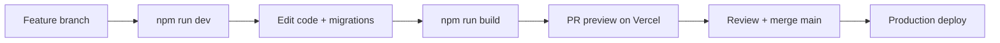

# 09 — Production lifecycle

## Environments

| Environment | Purpose | Supabase | URL |
|-------------|---------|----------|-----|
| **Local** | Dev | Optional Docker (`npm run db:start`) or cloud | `localhost:3000` |
| **Preview** | Vercel PR previews | Same or branch DB | `*.vercel.app` |
| **Production** | Live users | `firqlsjixojnrofycwbs` | Custom domain |

## Development cycle



### Daily developer commands

```powershell
cd .
npm run dev              # local app
npm run db:push          # schema to cloud (after link)
npm run build            # must pass before merge
npm run lint             # eslint
```

## Database release cycle

1. Add SQL file: `supabase/migrations/YYYYMMDDHHMMSS_description.sql`
2. Test locally: `npm run db:reset`
3. Review RLS policies in PR
4. Deploy app + run `npm run db:push` against production project
5. Never edit old migration files—only add new ones

## App release cycle (checklist)

### Before merge

- [ ] `npm run build` passes
- [ ] No secrets in diff
- [ ] Auth flows tested (email login minimum)
- [ ] Mobile smoke test (375px width)
- [ ] Migration reviewed if schema changed

### Before announcing prod

- [ ] Vercel root = `the-perfect-trader`
- [ ] Env vars set on Vercel (Supabase + Gemini)
- [ ] Supabase Site URL + redirects = production domain
- [ ] PWA icons present
- [ ] `/auth/callback` implemented if OAuth enabled
- [ ] Privacy policy matches data practices
- [ ] Error monitoring (Sentry optional)

### After deploy

- [ ] Smoke: signup → onboarding → today → log trade
- [ ] Verify `trader_snapshots` row created
- [ ] Check Vercel function logs for `/api/parse-trade`

## CI/CD (recommended, not yet in repo)

| Step | Tool |
|------|------|
| Lint + build on PR | GitHub Actions |
| Preview deploy | Vercel Git integration |
| DB migrate on release | Manual or `supabase db push` in workflow |
| E2E | Playwright (future)—login + today flow |

## Versioning

| What | Scheme |
|------|--------|
| App UI | `package.json` version (0.1.0) |
| Snapshot schema | `DATA_VERSION` in `supabase-data.ts` (1.1.0) |
| DB migrations | Timestamp filenames |

When breaking snapshot shape: bump `DATA_VERSION` + migration path for old clients.

## Rollback

| Layer | Action |
|-------|--------|
| Vercel | Redeploy previous deployment |
| Database | Supabase PITR or reverse migration (careful) |
| Feature flag | Env var to disable AI or Pro gate |

## Observability (to add)

| Signal | Tool suggestion |
|--------|-----------------|
| Errors | Sentry |
| Analytics | Vercel Analytics or Plausible |
| Supabase | Dashboard logs, RLS denials |
| AI cost | Gemini usage dashboard |

## Roles & ownership

| Role | Owns |
|------|------|
| Product | Flows in [02-USER-FLOWS](./02-USER-FLOWS-AND-LOOPS.md) |
| Engineering | Migrations, API, agents |
| Ops | Vercel + Supabase dashboards |
| Security | [06-SECURITY](./06-SECURITY.md) checklist |
