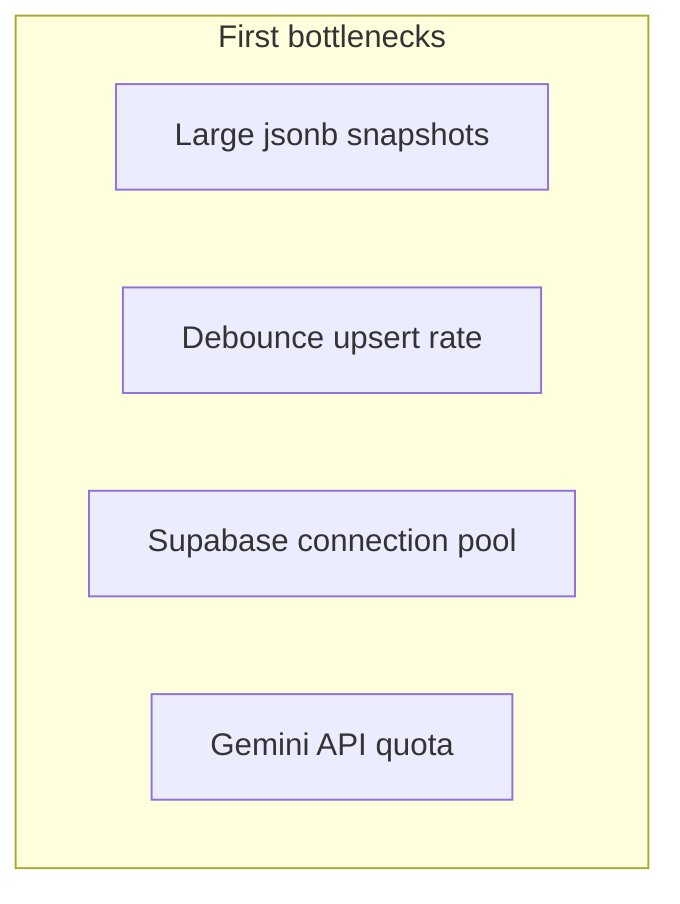

# 10 — Scaling & capacity

## Current architecture limits

The app uses **one JSON row per user** in Supabase. This scales well for **early production** (hundreds to low thousands of MAU) with simple ops.

## User capacity (rough estimates)

Assumptions: Vercel Hobby/Pro, Supabase Pro Tokyo, typical trader 5–20 trades/day.

| Scale | MAU | Feasibility | Notes |
|-------|-----|-------------|-------|
| MVP | 10–500 | Comfortable | Current design |
| Growth | 500–5,000 | OK with monitoring | Watch jsonb size p95 |
| Scale | 5,000–50,000 | Needs normalized DB | Split trades table |
| High | 50,000+ | Redesign | Read replicas, edge caching, job queue |

**Concurrent users:** Next.js on Vercel scales horizontally; Supabase handles thousands of concurrent connections on paid tiers. Client state is **not** server-sticky.

## Per-user data growth

| Data | Growth rate | Risk |
|------|-------------|------|
| Trades array in JSON | ~1–2 KB/trade | Payload &gt; 1 MB slows parse |
| Diary images in JSON | High | **Do not** store binary in jsonb |
| Coach messages | Low | Prune old messages |

**Rule of thumb:** Alert when `length(data)` &gt; 500 KB per user.

## API rate limits (to implement)

| Endpoint | Suggested limit |
|----------|-----------------|
| `/api/parse-trade` | 20 req/min/user |
| Supabase auth | Supabase defaults |
| Snapshot upsert | Debounced 1.2s (already) |

## Cost drivers

| Service | Driver |
|---------|--------|
| Vercel | Bandwidth, serverless invocations |
| Supabase | DB size, auth MAU, egress |
| Gemini | Tokens per parse-trade call |

**Cost control:** Mock AI when no key; cache parse results by note hash (future).

## UI “how many users” (display)

The UI does **not** show multi-user features yet—single trader per account.

| Feature | Multi-user? |
|---------|-------------|
| Login | 1 user per auth account |
| Admin terminal | Mock user list (demo) |
| Teams / coaches | Not built |

## Scaling path (when to change what)

| Trigger | Action |
|---------|--------|
| Snapshot &gt; 500 KB | Normalize `trades` table |
| Slow `/stats` | Precompute analytics server-side |
| AI cost high | Batch weekly reviews only |
| Global users far from Tokyo | Supabase read replica or CDN for static |
| OAuth abuse | CAPTCHA on signup |

## Device coverage at scale

Same web app serves all devices—no separate native binaries required until push/background sync needed.

| Need | Solution |
|------|----------|
| Offline trading floor | Service worker + queue (not implemented) |
| Push alerts | Web Push + Supabase Edge (future) |
| App Store presence | Capacitor wrapper or native later |

## Capacity testing (recommended)

1. Seed script: 2,000 trades in one snapshot → measure hydrate time  
2. k6 or Artillery: 50 concurrent logins  
3. Supabase dashboard: connection count under load  

Document results in a future `docs/production/PERF-RESULTS.md` after first test run.
