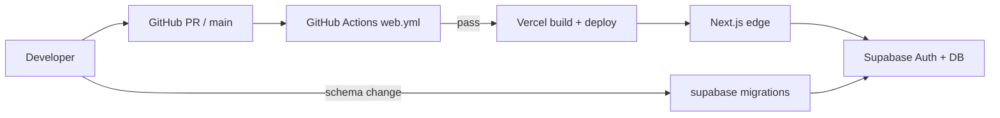

# Web app — DevOps and release pipeline

**v1 focus:** Ship and iterate on the **Next.js** app at repo root (`src/`). Mobile (`mobile/`) stays in repo but is **not** on the critical path until web beta is stable.

## Stack (locked)

| Layer | Choice | Location |
|-------|--------|----------|
| App | Next.js 16, React 19, Tailwind 4 | `src/` |
| Hosting | Vercel (Hobby) | `vercel.json` → region `bom1` |
| Auth + DB | Supabase | `supabase/` |
| AI (optional) | Gemini via `/api/parse-trade` | `GEMINI_API_KEY` in Vercel only |

Same data contract as mobile: one jsonb row per user in `trader_snapshots`, `DATA_VERSION` `1.1.0`, ~1.2s sync debounce.

---

## Environments

| Env | App URL | Supabase | When to use |
|-----|---------|----------|-------------|
| **Local** | `http://localhost:3000` | Dev project or local stack | Daily dev |
| **Preview** | `*.vercel.app` (PR branches) | Same as prod *or* staging project (recommended before scale) | PR review, QA |
| **Production** | Custom domain / main Vercel URL | Tokyo project `firqlsjixojnrofycwbs` | Users |

**Secrets:** `.env.local` locally (gitignored). Vercel **Production** + **Preview** for cloud. Never commit keys; run `npm run secrets:check` before push.

### Env vars (web)

| Variable | Local | Vercel | Notes |
|----------|-------|--------|-------|
| `NEXT_PUBLIC_SUPABASE_URL` | Yes | Yes | Public |
| `NEXT_PUBLIC_SUPABASE_ANON_KEY` | Yes | Yes | Public `anon` only |
| `GEMINI_API_KEY` | Optional | Production | Server route only — no `NEXT_PUBLIC_` |
| `SUPABASE_SERVICE_ROLE_KEY` | Avoid | Only if admin server routes | Never in client bundle |

Copy template: `.env.local.example` → `.env.local`.

---

## End-to-end pipeline



### 1. Local development

```powershell
npm install
npm run dev          # http://localhost:3000
npm run lint
npm run build        # must pass before PR
npm run secrets:check
```

DB (when schema changes):

```powershell
npm run db:push      # linked cloud project
# or: npm run db:start + db:reset for local Supabase
```

See [guides/LOCAL_DEVELOPMENT.md](../guides/LOCAL_DEVELOPMENT.md).

### 2. Pull request

1. Branch from `main` (e.g. `feat/today-sync-fix`).
2. Change only `src/`, `public/`, root config, or `supabase/migrations/` as needed.
3. Open PR → **GitHub Actions** runs:
   - `npm ci`
   - `npm run lint`
   - `npm run build` (with dummy public Supabase env if secrets not in CI — see workflow)
4. Vercel **Preview Deployment** on the PR (if repo connected).
5. Manual QA on preview URL; check Supabase row writes for test user.

**PR gate:** CI green + no secrets in diff + preview smoke (login → today → save).

### 3. Merge to `main` (production deploy)

1. Merge PR.
2. **GitHub Actions** runs same checks on `main`.
3. **Vercel** auto-builds `npm run build` and deploys **Production** (if Git integration on `main`).
4. Post-deploy:
   - Supabase **Authentication → URL configuration** includes production URL (if new domain).
   - Smoke: signup, onboarding, today, journal, stats.
   - Table Editor: new user has `trader_snapshots` row.

Launch checklist: [guides/LAUNCH.md](../guides/LAUNCH.md).  
Cloud detail: [guides/CLOUD_DEPLOYMENT.md](../guides/CLOUD_DEPLOYMENT.md).

### 4. Database migrations (not automatic on Vercel)

Schema changes are **manual** from a trusted machine (or future CI job with service role):

```powershell
npx supabase login
npx supabase link --project-ref firqlsjixojnrofycwbs
npm run db:push
```

**Rule:** Ship backward-compatible jsonb changes first; breaking changes need a migration plan and app `DATA_VERSION` bump in both web and mobile.

---

## CI (GitHub Actions)

Workflow: [`.github/workflows/web.yml`](../../.github/workflows/web.yml)

| Trigger | Paths |
|---------|--------|
| `push` / `pull_request` | `src/**`, `public/**`, `package.json`, `package-lock.json`, `next.config.*`, `vercel.json`, workflow file |

| Job | Steps |
|-----|--------|
| `lint-build` | Node 20, `npm ci`, `npm run lint`, `npm run build` |

Mobile CI ([`flutter-mobile.yml`](../../.github/workflows/flutter-mobile.yml)) runs only when `mobile/**` changes — independent of web.

---

## CD (Vercel)

| Setting | Value |
|---------|--------|
| Root directory | `.` (repo root) |
| Framework | Next.js |
| Install | `npm ci` |
| Build | `npm run build` |
| Region | `bom1` (Mumbai — see `vercel.json`) |

**Branches:**

| Branch | Vercel env | Deploy |
|--------|------------|--------|
| `main` | Production | Auto |
| Other / PR | Preview | Auto (recommended) |

Promote / rollback: Vercel → **Deployments** → Promote previous production deployment.

---

## Versioning and releases

| Artifact | Version source |
|----------|----------------|
| Web app | `package.json` `version` (semver for tags/releases) |
| Data schema | `DATA_VERSION` in app + snapshot payload |
| DB | `supabase/migrations/*.sql` timestamps |

**Release cadence (suggested):** continuous deploy on `main`; tag `v0.x.y` on GitHub for changelog / marketing only.

---

## Git workflow

- **Trunk-based:** short-lived branches → PR → `main`.
- **Required before merge:** web CI green, `secrets:check` clean locally.
- **Do not merge:** migrations without `db:push` plan, or env-only commits with real keys.

---

## Monitoring and ops (to add)

| Tool | Purpose |
|------|---------|
| Vercel Analytics / Speed Insights | Web vitals |
| Sentry | Client + server errors |
| PostHog / Plausible | Funnel (`signup_complete`, `pre_session_complete`, …) |
| Supabase dashboard | Auth errors, DB size, RLS |

---

## Web vs mobile (v1)

| Priority | Surface | Reason |
|----------|---------|--------|
| **P0** | Web | Fast iteration on Windows, no store fees, SEO landing, full feature set in `src/` |
| **P1** | Mobile | After web beta; reuse `trader_snapshots` contract — see [mobile/DEVOPS_PIPELINE.md](../mobile/DEVOPS_PIPELINE.md) |

Flutter Web is **out of scope** (see [TECH_STACK_DECISIONS.md](../mobile/TECH_STACK_DECISIONS.md)).

---

## Production blockers (web)

From [production/OPEN-QUESTIONS.md](../production/OPEN-QUESTIONS.md) and [CLOUD_DEPLOYMENT.md](../guides/CLOUD_DEPLOYMENT.md):

1. OAuth `/auth/callback` tested on production URL
2. PWA icons in `public/`
3. Privacy/terms mention cloud sync
4. Pro/trial gate: real Stripe or clearly labeled mock

---

## Quick reference commands

```powershell
npm run dev
npm run build
npm run lint
npm run secrets:check
npm run db:push
```
